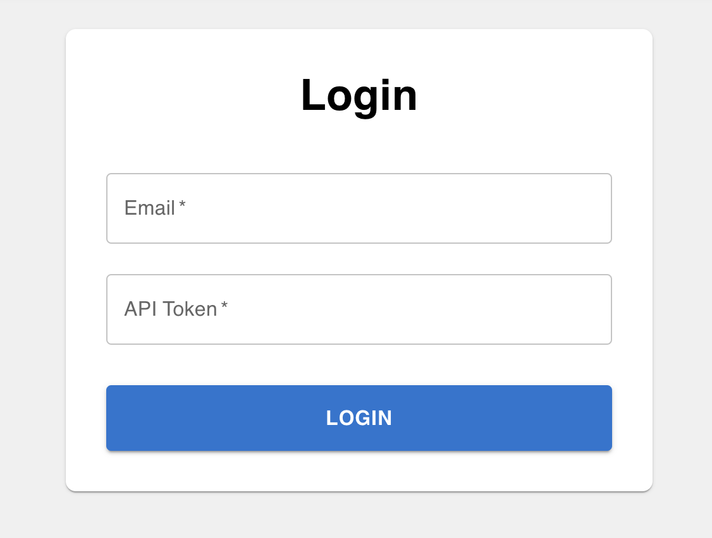
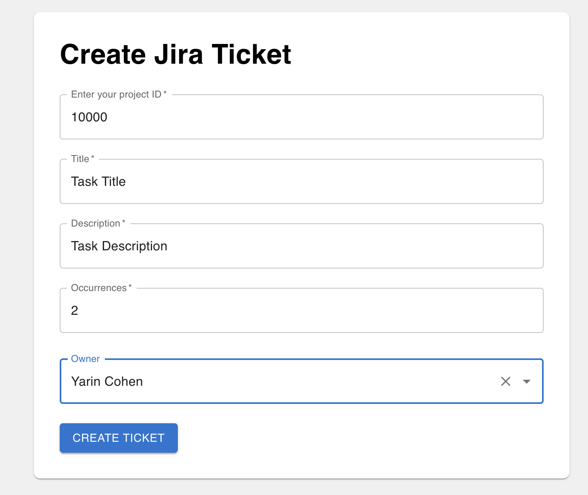
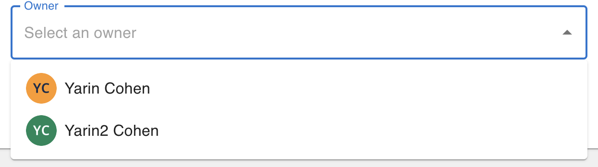
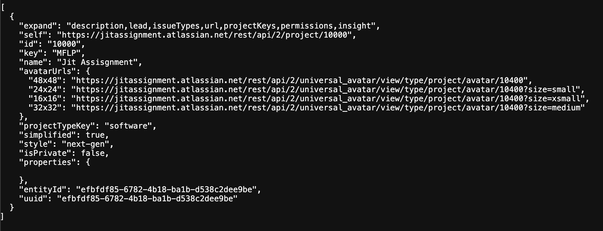

# JIRA Integration App

This application is a React-based frontend and an Express.js backend that integrates with the JIRA API to allow users to authenticate and create tasks in their JIRA projects.

## Features
- User authentication via the JIRA API
- Ability to create tasks in a JIRA project
- Built using React, TypeScript, React Router DOM, and Express.js

---

## Prerequisites
To set up and run this application, ensure you have the following:
- Node.js and npm installed
- A valid JIRA account

---

## Backend Setup

1. **Create a `.env` file in the backend folder:**
   - Add the following line to the `.env` file:
     ```env
     PROJECT_NAME=<your-jira-project-name>
     ```
   - Replace `<your-jira-project-name>` with the name of your JIRA project.

2. **Generate an API Key:**
   - Visit [JIRA API Token Management](https://id.atlassian.com/manage-profile/security/api-tokens).
   - Generate a new API key and keep it secure.

3. **Get Your Project ID:**
   - Open your browser and navigate to the following URL, replacing `yourjiradomain` with your JIRA domain:
     ```
     https://yourjiradomain.atlassian.net/rest/api/2/project
     ```
   - Look for the `id` associated with your project in the response.

4. **Start the Backend Server:**
   - Navigate to the backend folder:
     ```bash
     cd backend
     ```
   - Install dependencies:
     ```bash
     npm install
     ```
     - Run the server
     ```bash
      npm run dev
      ```

---

## Frontend Setup

1. Clone the repository:
   ```bash
   git clone https://github.com/Yarinnc/jira-integration.git
   ```

2. Navigate to the project directory:
   ```bash
   cd jira-integration
   ```

3. Install dependencies:
   ```bash
   npm install
   ```

4. Start both the frontend server:
   ```bash
   npm run dev
   ```

---

## Technologies Used
- **React**: For building the user interface
- **TypeScript**: For type-safe code
- **React Router DOM**: For navigation within the app
- **Express.js**: For backend API integration
- **JIRA API**: For integration and task creation

---

## Usage
1. Start both the frontend and backend servers.
2. Open the application in your browser.
3. Authenticate using your JIRA API key.
4. Select your JIRA project using the project ID.
5. Create a task by filling in the required details in the form.

---
## Screenshots
Login


Ticket Creation


Selecting User


Getting Project Id



